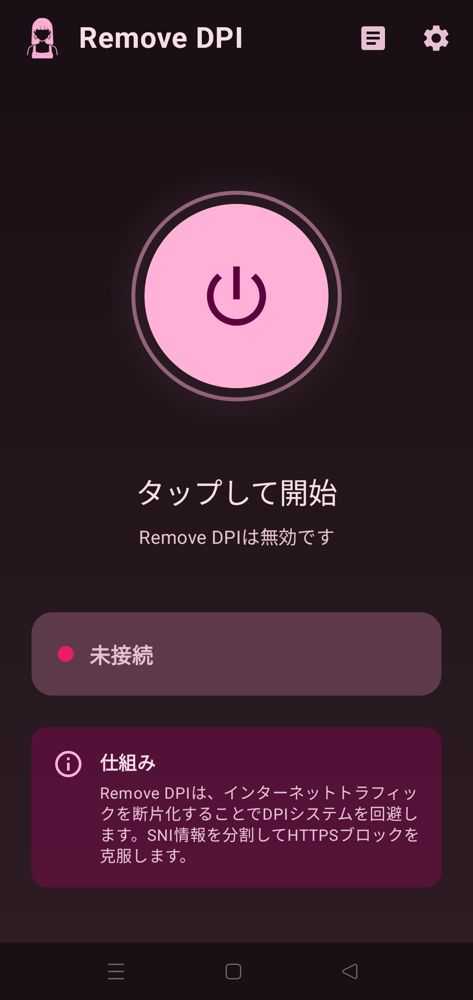
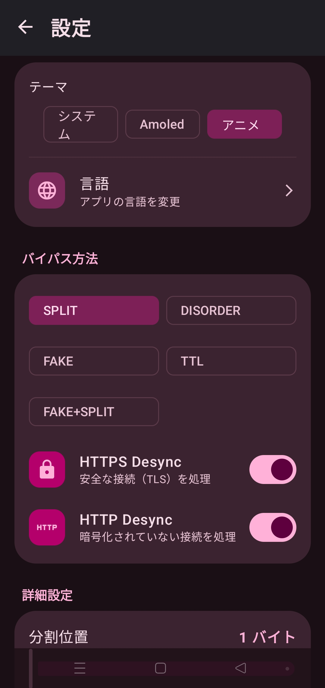
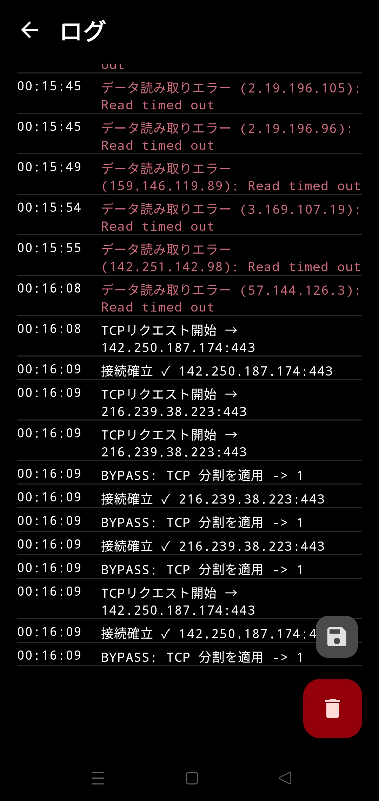

  <!-- App Logo -->
  

  <h1>🛡️ RemoveDPI</h1>
  
  
<strong>Android用 DPI回避ツール</strong>

  <!-- Language Shields -->
  

    
    
    
    
  

  <!-- Dynamic Badges -->
  

    
    
    
  

  

    
    
    
    
  

   

  

 

> [!IMPORTANT]
> これはVPNではありません。IPを隠したりデータを暗号化したりするものではありません。ISPのDPI分析を回避して、ブロックされたサイトへのアクセスを可能にします。**速度低下はありません。**

---

## ⚡ 特徴

| | |
|:---|:---|
| 🚫 **ブロック回避** | Discord、RedditなどのブロックされたサービスにVPNなしでアクセス |
| 🚀 **スロットリング解除** | YouTube、Instagram、Xでの速度制限を無効化 |
| ⚡ **ゼロ遅延** | リモートサーバーに接続しないため、Pingの増加なし |
| 🔓 **Root不要** | Android 9以上のすべてのデバイスで動作 |

---

## 📸 スクリーンショット

  
  
  
  

---

## 🎨 テーマ

`Material You` · `アニメ` · `AMOLED`

---

## 🛠️ 仕組み

<strong>技術的詳細</strong>

 

- **TCPフラグメンテーション:** `ClientHello`パケットを断片化してDPI分析を防ぐ
- **QUICブロック:** UDP 443ポートをブロックしてTCP経由の通信を強制

---

## 📥 インストール

1. [Releases](https://github.com/GameSketchers/RemoveDPI/releases/latest)からAPKをダウンロード
2. インストールして開く
3. **開始**ボタンを押す
4. VPN権限を承認する

---

## 🤝 クレジット

| プロジェクト | 貢献 |
|:---|:---|
| [GoodbyeDPI](https://github.com/ValdikSS/GoodbyeDPI) | オリジナルコンセプト |
| [GoodbyeDPI-Turkey](https://github.com/cagritaskn/GoodbyeDPI-Turkey) | 設定リファレンス |

   
  <strong>開発者:</strong> <a href="https://github.com/anonimbiri-IsBack">@Anonimbiri</a>

---

## ⚖️ 免責事項

このソフトウェアは**教育目的**で開発されています。ユーザーは居住国の法律を遵守する責任があります。開発者は悪用について一切の責任を負いません。