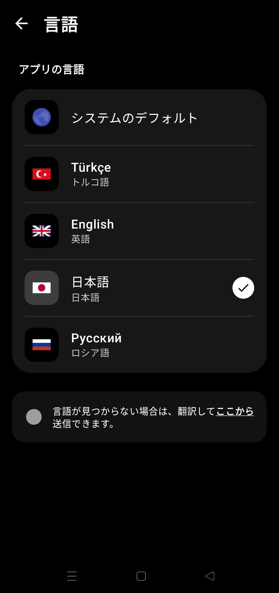

  <!-- Banner -->
  

  <!-- Language Shields -->
  

    
    
    
    
  

  <!-- Dynamic Badges -->
  

    
    
    
  

  <!-- Tech Badges -->
  

    
    
    
    
  

   

  

 

> [!IMPORTANT]
> これはVPNではありません。IPを隠したり、データを暗号化したりしません。ISPのDPI分析をバイパスしてブロックされたサイトへのアクセスを可能にします。**速度低下なし。**

---

## ⚡ 機能

| | |
|:---|:---|
| 🚫 **制限回避** | VPNなしでDiscord、Reddit、ブロックされたサービスにアクセス |
| 🚀 **スロットリング解除** | YouTube、Instagram、Xの速度制限を無効化 |
| ⚡ **ゼロレイテンシー** | リモートサーバーに接続しない、ping増加なし |
| 🔓 **Root不要** | Android 9+のすべてのデバイスで動作 |

---

## 📸 スクリーンショット

  
  
  
  
  

---

## 🎨 テーマ

`Material You` · `Anime` · `AMOLED`

---

## 🛠️ 仕組み

<strong>技術詳細</strong>

 

- **TCP Fragmentation:** `ClientHello`パケットを分割してDPI分析を防止
- **QUIC Block:** UDPポート443をブロックしてトラフィックをTCPに強制

---

## 📥 インストール

1. [Releases](https://github.com/GameSketchers/RemoveDPI/releases/latest)からAPKをダウンロード
2. インストールして開く
3. **開始**ボタンを押す
4. VPN許可を承認

---

## 🤝 クレジット

| プロジェクト | 貢献 |
|:---|:---|
| [GoodbyeDPI](https://github.com/ValdikSS/GoodbyeDPI) | オリジナルコンセプト |
| [GoodbyeDPI-Turkey](https://github.com/cagritaskn/GoodbyeDPI-Turkey) | TR設定 |

   
  <strong>開発者:</strong> <a href="https://github.com/anonimbiri-IsBack">@Anonimbiri</a>

---

## ⚖️ 免責事項

このソフトウェアは**教育目的**で開発されています。ユーザーは自国の法律を遵守する責任があります。開発者は誤用について責任を負いません。