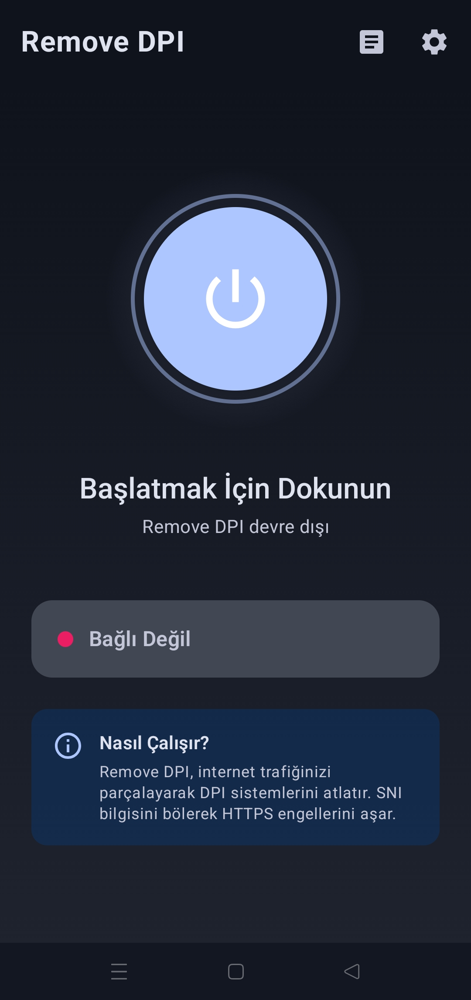
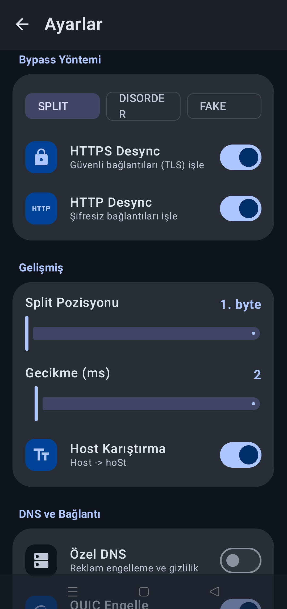
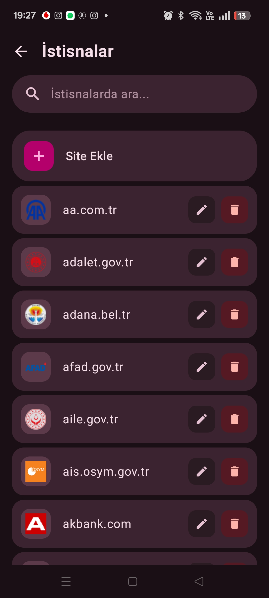
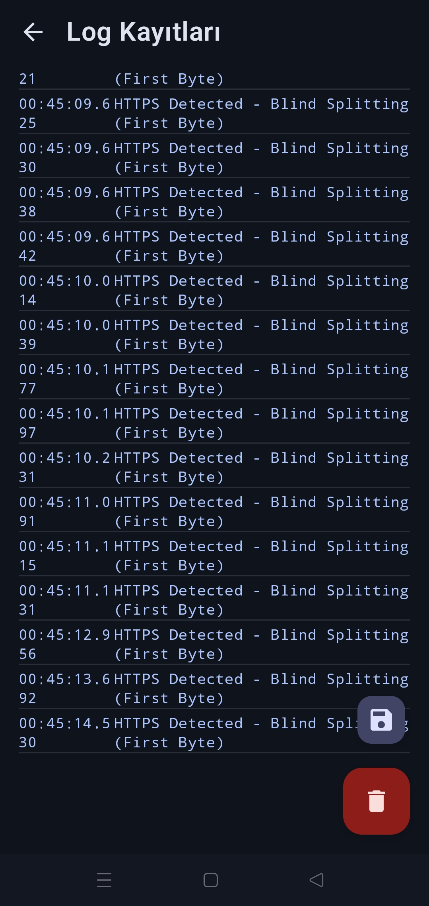

<div align="center">

  <h1>🛡️ RemoveDPI for Android</h1>

  <p>
    <strong>DPI (Derin Paket İnceleme) tabanlı sansürleri ve hız kısıtlamalarını aşın.</strong>
  </p>

  <p>
    <a href="https://www.android.com">
      
    </a>
    <a href="https://kotlinlang.org">
      
    </a>
    <a href="https://github.com/GameSketchers/RemoveDPI/releases">
      
    </a>
    <a href="LICENSE">
      
    </a>
  </p>

  <p>
    <a href="#-neleri-çözer">Özellikler</a> •
    <a href="#-kurulum-ve-kullanım">Kurulum</a> •
    <a href="#-nasıl-çalışır">Çalışma Mantığı</a> •
    <a href="https://github.com/GameSketchers/RemoveDPI/releases">📥 Hemen İndir</a>
  </p>

</div>

---

> [!IMPORTANT]
> **Bu uygulama bir VPN değildir.** > IP adresinizi gizlemez veya verilerinizi şifrelemez. Sadece internet sağlayıcınızın (ISP) paketlerinizi analiz etmesini engelleyerek yasaklı sitelere girmenizi sağlar. **Hız düşüşü yaşatmaz.**

---

## ⚡ Neleri Çözer?

Bu araç, Türkiye'deki internet servis sağlayıcılarının uyguladığı **DPI (Deep Packet Inspection)** sistemlerini atlatmak için tasarlanmıştır.

| Özellik | Açıklama |
| :--- | :--- |
| 🚫 **Erişim Engelleri** | Discord, Reddit ve diğer yasaklı servislere VPN'siz giriş sağlar. |
| 🚀 **Hız Kısıtlamaları** | YouTube, Instagram ve X (Twitter) üzerindeki yapay yavaşlatmayı (Throttling) kaldırır. |
| ⚡ **Sıfır Hız Kaybı** | Uzak bir sunucuya bağlanmadığı için pinginiz artmaz, hızınız düşmez. |
| 🔓 **Root Gerektirmez** | Herhangi bir Android cihazda (Android 9+) root yetkisi olmadan çalışır. |

---

## 📸 Ekran Görüntüleri

<div align="center">
  
  
  
  
</div>

---

## 🛠️ Nasıl Çalışır?

RemoveDPI, Android'in yerel `VpnService` özelliğini kullanarak trafiği cihaz içinde yönlendirir ve paketleri modifiye eder.

<details>
<summary>⚙️ <strong>Teknik Detayları Görmek İçin Tıklayın</strong></summary>
<br>

1.  **TCP Fragmantasyonu (Blind Split):** HTTPS bağlantısı kurulurken gönderilen `ClientHello` paketini parçalara ayırır (örneğin ilk baytı koparır). DPI cihazları bu parçalanmış paketi anlamlandıramaz ve "bu site yasaklı değil" diyerek geçişe izin verir.

2.  **QUIC / UDP Engelleme:**
    Google ve Meta servislerinin (YouTube, Instagram) kullandığı UDP 443 portunu (QUIC protokolü) engeller. Tarayıcıyı ve uygulamaları TCP kullanmaya zorlar. TCP, manipüle edilmesi (DPI atlatılması) en kolay protokoldür.

</details>

---

## 📥 Kurulum ve Kullanım

1.  **İndir:** En son sürümü [Releases Sayfasından](https://github.com/GameSketchers/RemoveDPI/releases) indirin.
2.  **Yükle:** İndirdiğiniz `.apk` dosyasını kurun.
3.  **Başlat:** Uygulamayı açın ve devasa **"BAŞLAT"** butonuna basın.
4.  **İzin Ver:** Android "VPN Bağlantı İsteği" sorarsa onaylayın.

> **İpucu:** Uygulama varsayılan olarak "Türkiye Modu" ayarlarıyla gelir. Ekstra ayar yapmanıza gerek yoktur. Eğer bağlanamazsanız ayarlardan **"DPI Bypass Mode: SPLIT"** seçeneğini kontrol edin.

---

## 🤝 Teşekkürler & Kredi

Bu proje, internet özgürlüğü için çalışan devlerin omuzlarında yükselmektedir:

* **GoodbyeDPI (ValdikSS):** Orijinal PC mantığı ve ilham kaynağı.
* **GoodbyeDPI-Turkey (cagritaskn):** Türkiye'ye özel konfigürasyonlar.
* **Geliştirici:** [Anonimbiri](https://github.com/anonimbiri-IsBack)

---

## ⚖️ Yasal Uyarı

```text
Bu yazılım, ağ trafiği analizi ve sansür yöntemlerinin teknik incelemesi amacıyla 
EĞİTİM AMAÇLI geliştirilmiştir. Kullanıcılar, bu yazılımı kullanırken bulundukları 
ülkenin yasalarına uymakla yükümlüdür. Geliştirici, kötüye kullanımdan sorumlu değildir.