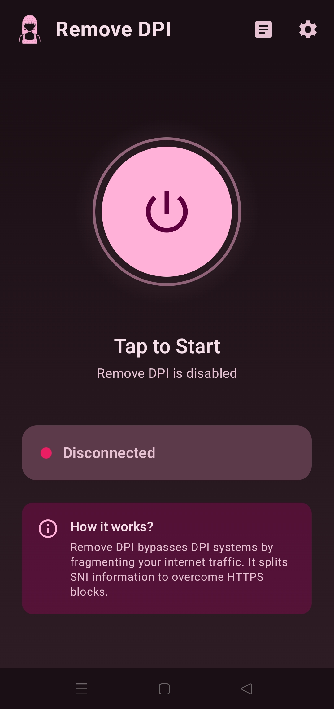
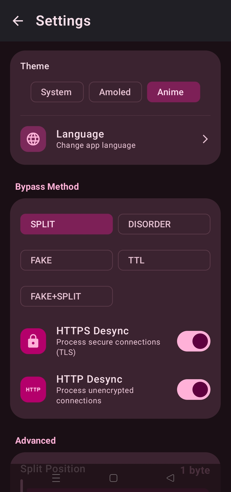
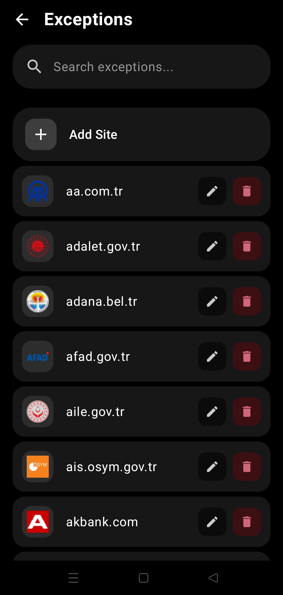
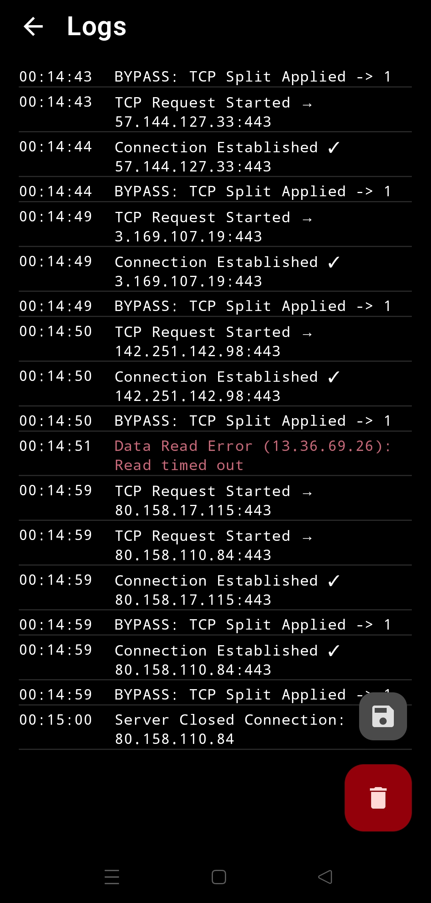
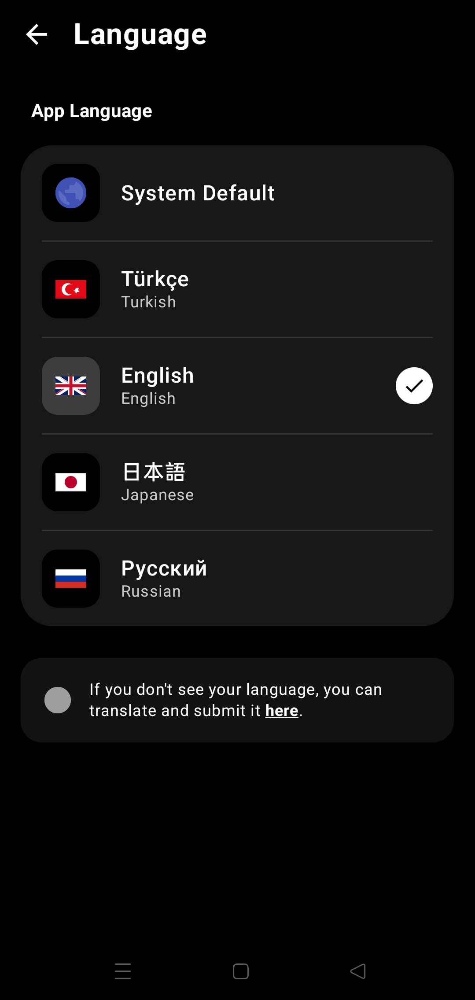

  <!-- Banner -->
  

  <!-- Language Shields -->
  

    
    
    
    
  

  <!-- Dynamic Badges -->
  

    
    
    
  

  <!-- Tech Badges -->
  

    
    
    
    
  

   

  

 

> [!IMPORTANT]
> This is not a VPN. It does not hide your IP or encrypt your data. It enables access to blocked sites by bypassing ISP DPI analysis. **No speed loss.**

---

## ⚡ Features

| | |
|:---|:---|
| 🚫 **Bypass Restrictions** | Access Discord, Reddit, and blocked services without VPN |
| 🚀 **Remove Throttling** | Disables speed limits on YouTube, Instagram, X |
| ⚡ **Zero Latency** | No remote server connection, no ping increase |
| 🔓 **No Root Required** | Works on all Android 9+ devices |

---

## 📸 Screenshots

  
  
  
  
  

---

## 🎨 Themes

`Material You` · `Anime` · `AMOLED`

---

## 🛠️ How it Works?

<strong>Technical Details</strong>

 

- **TCP Fragmentation:** Fragments the `ClientHello` packet to prevent DPI analysis
- **QUIC Block:** Blocks UDP port 443 to force traffic over TCP

---

## 📥 Installation

1. Download APK from [Releases](https://github.com/GameSketchers/RemoveDPI/releases/latest)
2. Install and open
3. Press **START** button
4. Approve VPN permission

---

## 🤝 Credits

| Project | Contribution |
|:---|:---|
| [GoodbyeDPI](https://github.com/ValdikSS/GoodbyeDPI) | Original concept |
| [GoodbyeDPI-Turkey](https://github.com/cagritaskn/GoodbyeDPI-Turkey) | TR configurations |

   
  <strong>Developer:</strong> <a href="https://github.com/anonimbiri-IsBack">@Anonimbiri</a>

---

## ⚖️ Legal Disclaimer

This software is developed for **educational purposes**. Users are responsible for complying with the laws of their country. The developer cannot be held responsible for misuse.