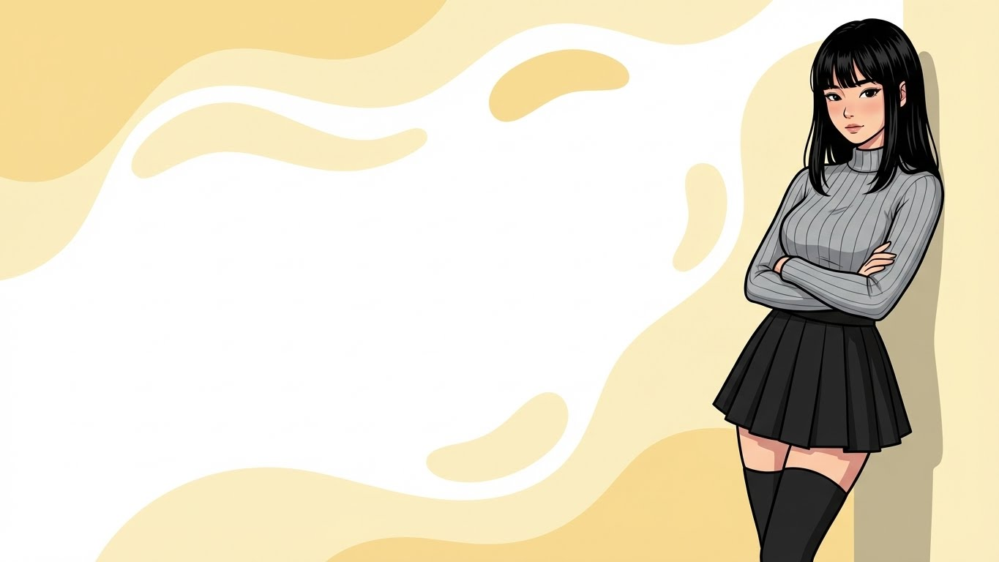
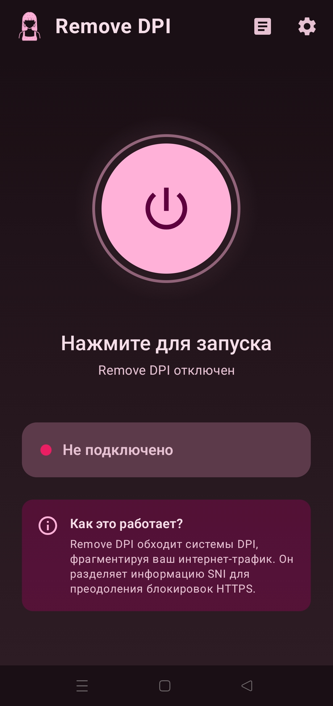
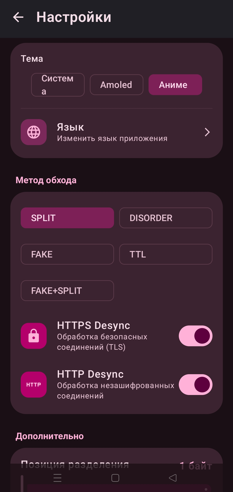
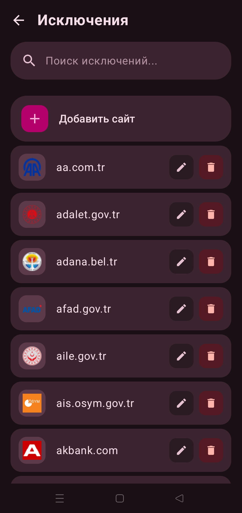
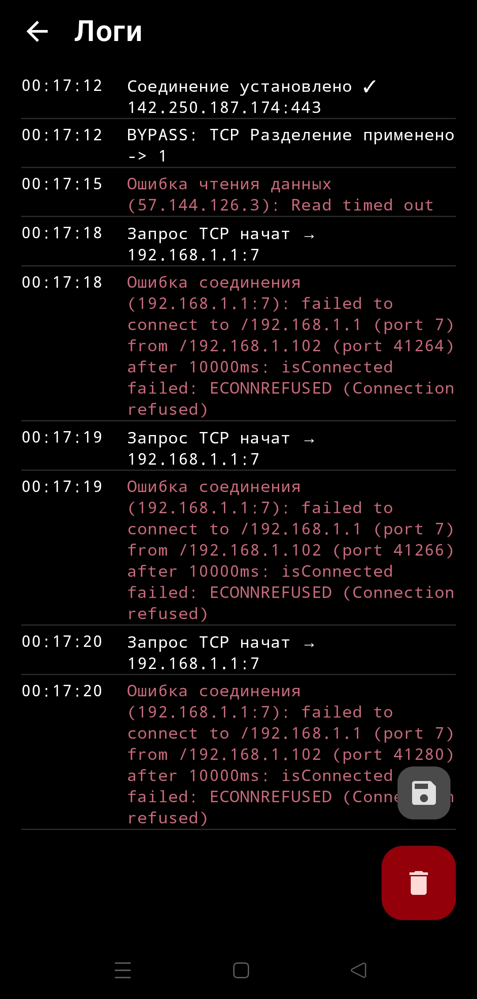
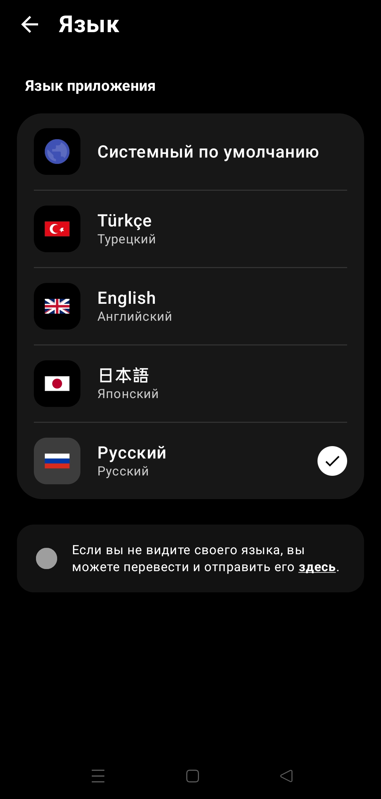

  <!-- Banner -->
  

  <!-- Language Shields -->
  

    
    
    
    
  

  <!-- Dynamic Badges -->
  

    
    
    
  

  <!-- Tech Badges -->
  

    
    
    
    
  

   

  

 

> [!IMPORTANT]
> Это не VPN. Не скрывает ваш IP и не шифрует данные. Обеспечивает доступ к заблокированным сайтам путём обхода DPI-анализа провайдера. **Без потери скорости.**

---

## ⚡ Возможности

| | |
|:---|:---|
| 🚫 **Обход блокировок** | Доступ к Discord, Reddit и заблокированным сервисам без VPN |
| 🚀 **Снятие ограничений** | Отключает ограничения скорости на YouTube, Instagram, X |
| ⚡ **Нулевая задержка** | Нет подключения к удалённому серверу, нет увеличения пинга |
| 🔓 **Без Root** | Работает на всех устройствах Android 9+ |

---

## 📸 Скриншоты

  
  
  
  
  

---

## 🎨 Темы

`Material You` · `Anime` · `AMOLED`

---

## 🛠️ Как это работает?

<strong>Технические детали</strong>

 

- **TCP Fragmentation:** Фрагментирует пакет `ClientHello` для предотвращения DPI-анализа
- **QUIC Block:** Блокирует UDP порт 443 для принудительного использования TCP

---

## 📥 Установка

1. Скачайте APK из [Releases](https://github.com/GameSketchers/RemoveDPI/releases/latest)
2. Установите и откройте
3. Нажмите кнопку **СТАРТ**
4. Подтвердите разрешение VPN

---

## 🤝 Благодарности

| Проект | Вклад |
|:---|:---|
| [GoodbyeDPI](https://github.com/ValdikSS/GoodbyeDPI) | Оригинальная концепция |
| [GoodbyeDPI-Turkey](https://github.com/cagritaskn/GoodbyeDPI-Turkey) | Конфигурации для Турции |

   
  <strong>Разработчик:</strong> <a href="https://github.com/anonimbiri-IsBack">@Anonimbiri</a>

---

## ⚖️ Юридическое уведомление

Это программное обеспечение разработано в **образовательных целях**. Пользователи несут ответственность за соблюдение законов своей страны. Разработчик не несёт ответственности за неправомерное использование.