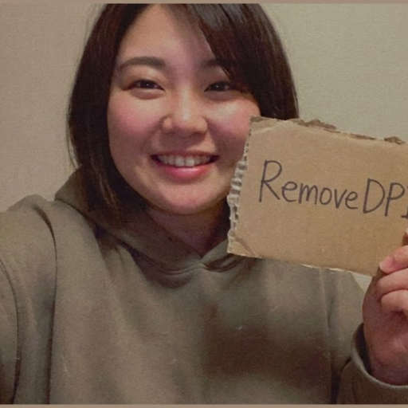
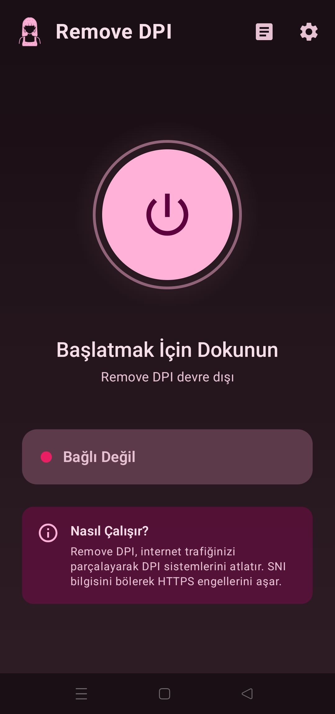
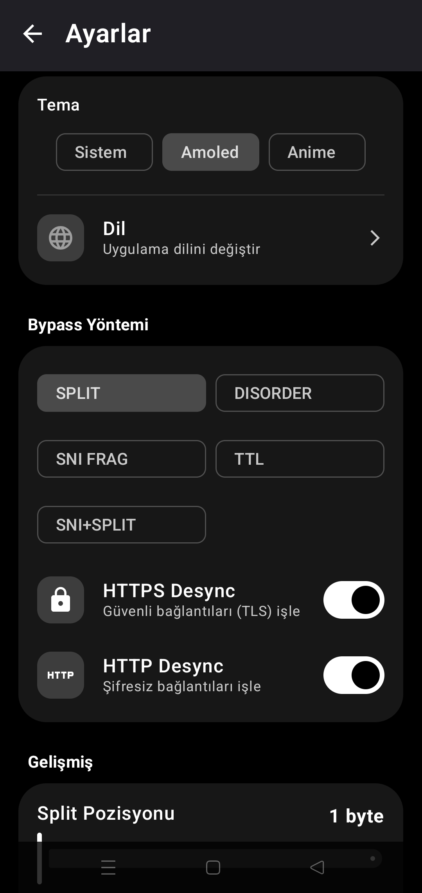
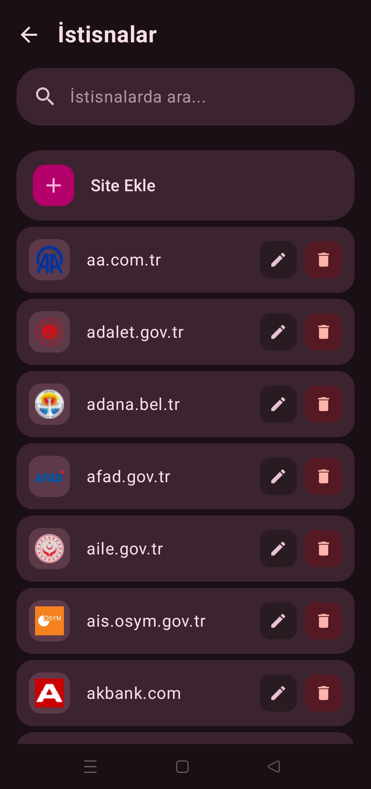
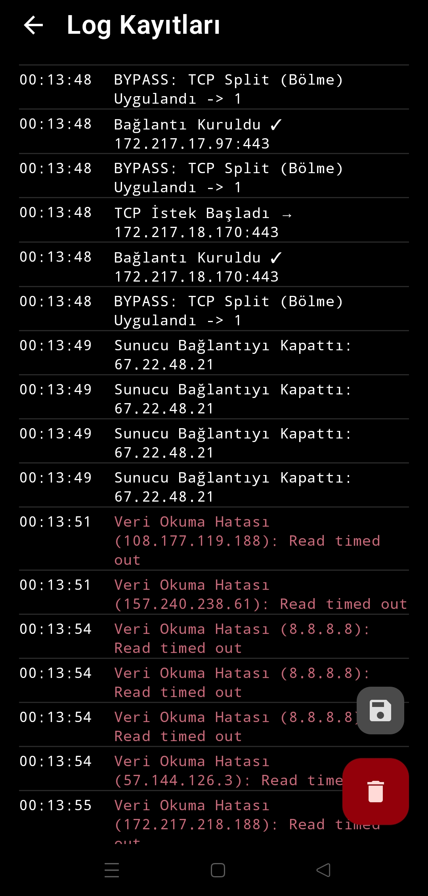

  <!-- App Logo -->
  

  <h1>🛡️ RemoveDPI</h1>
  
  
<strong>Android için DPI Bypass Aracı</strong>

  <!-- Language Shields -->
  

    
    
    
    
  

  <!-- Dynamic Badges -->
  

    
    
    
  

  

    
    
    
    
  

   

  

 

> [!IMPORTANT]
> Bu bir VPN değildir. IP gizlemez, veri şifrelemez. ISP'nin DPI analizini atlatarak engelli sitelere erişim sağlar. **Hız kaybı yaşatmaz.**

---

## ⚡ Özellikler

| | |
|:---|:---|
| 🚫 **Engel Atlatma** | Discord, Reddit ve yasaklı servislere VPN'siz erişim |
| 🚀 **Throttle Kaldırma** | YouTube, Instagram, X üzerindeki hız kısıtlamalarını devre dışı bırakır |
| ⚡ **Sıfır Gecikme** | Uzak sunucuya bağlanmaz, ping artışı olmaz |
| 🔓 **Root Gereksiz** | Android 9+ tüm cihazlarda çalışır |

---

## 📸 Ekran Görüntüleri

  
  
  
  

---

## 🎨 Temalar

`Material You` · `Anime` · `AMOLED`

---

## 🛠️ Nasıl Çalışır?

<strong>Teknik Detaylar</strong>

 

- **TCP Fragmentation:** `ClientHello` paketini parçalayarak DPI'ın analiz etmesini engeller
- **QUIC Block:** UDP 443 portunu engelleyerek trafiği TCP'ye zorlar

---

## 📥 Kurulum

1. [Releases](https://github.com/GameSketchers/RemoveDPI/releases/latest) sayfasından APK indir
2. Yükle ve aç
3. **BAŞLAT** butonuna bas
4. VPN iznini onayla

---

## 🤝 Krediler

| Proje | Katkı |
|:---|:---|
| [GoodbyeDPI](https://github.com/ValdikSS/GoodbyeDPI) | Orijinal konsept |
| [GoodbyeDPI-Turkey](https://github.com/cagritaskn/GoodbyeDPI-Turkey) | TR konfigürasyonları |

   
  <strong>Geliştirici:</strong> <a href="https://github.com/anonimbiri-IsBack">@Anonimbiri</a>

---

## ⚖️ Yasal Uyarı

Bu yazılım **eğitim amaçlı** geliştirilmiştir. Kullanıcılar bulundukları ülkenin yasalarına uymakla yükümlüdür. Geliştirici kötüye kullanımdan sorumlu tutulamaz.